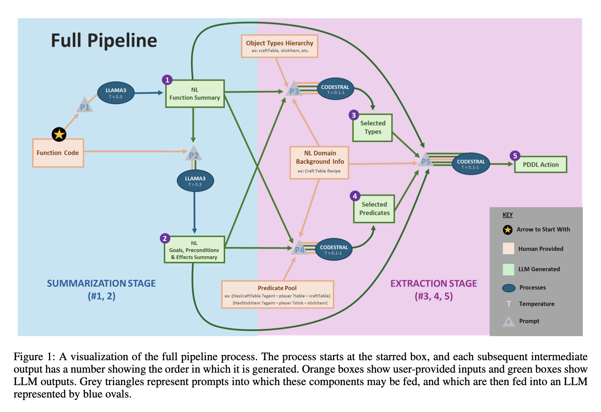

# JS-PDDL: L2P Paper Recreation
This is a paper recreation "Creating PDDL Models from Javascript using LLMs: Preliminary Results" (Sikes et al. 2024) using **Language-to-Plan (L2P)** 

[Original Paper Link](https://openreview.net/pdf?id=VyTxXSPmbE)

[L2P library GitHub link](https://github.com/AI-Planning/l2p/tree/main)

## Recreation
This Github recreates the major components of what we coin "JS-PDDL" framework where the LLM decomposes natural language information from operational models via Javascript functions. This then translates it into action PDDL specifications.

Specifically, this recreation only tests out the Minecraft domain – `craftItem` Javascript operational function model; which is then deconstructed into (4) actions:
- crafting-table
- sticks
- wooden-planks
- wooden-sword

## Methodology


**Motivation**
Previous work has delved into natural language to PDDL generation; little work has delved into operational models to PDDL.

1. Many automated bots exist to automate gameplay agents, so there is lots of code to draw from. 
2. A set of wiki documents is available in the form of written natural language that one can use as input.

## Assumptions
This framework assumes the following (such that they are given to the LLM):
- [x] `Javascript function`
- [x] `Action name`
- [x] `Action description`
- [x] `Predicates`
- [x] `Predicate descriptions`
- [x] `Object types`

LLM is tasked to derive:
- **Stage 1**: General summary of Javascript function.
- **Stage 2**: Summary of action goal, precondition, and effect – given Javascript function and *Stage 1*.
- **Stage 3**: Select appropriate types given *Object Types* pool, *Stage 1+2*, and *action name+description*.
- **Stage 4**: Select appropriate predicates given *Predicate* pool, *Stage 1+2*, and *action name+description*.
- **Stage 5**: Extrapolate PDDL action given all previous stage information.

## Experiment
This recreation was using both GPT4o set on (temp=0.3 for summarization; temp=0.5 for extraction) for simplicity purposes. The original experiment used Llama3 for *summarization* stage (temp=0.3) and Codestral for *extraction* stage (0.1, 0.5, 0.75 and 1.0).

Prompts can be found at ```prompt_templates```.